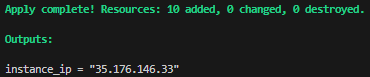
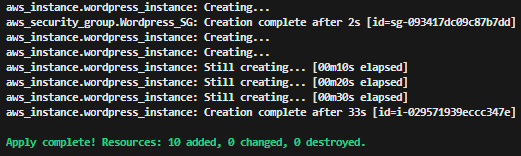
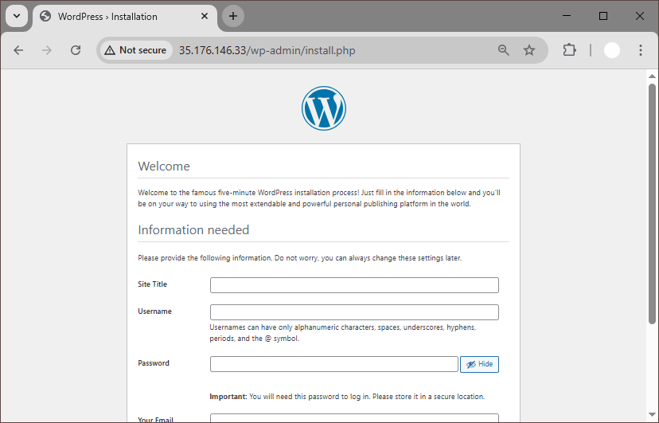

# 🚀 WordPress deployment via Terraform 

## Project Overview
This project provisions a WordPress-ready EC2 instance in AWS using Terraform. It automatically sets up networking, SSH keys, security groups, and uses a user data script to bootstrap the EC2 instance on launch. The script installs all necessary software on a fresh Ubuntu instance  — including NGINX, MySQL, PHP, and WordPress.

>**Note**: WordPress is installed manually via the web interface after the infrastructure is provisioned.

## 📚 Table of Contents
1. [Project Overview](#project-overview)  
2. [Prerequisites](#Prerequisites)
3. [Project Structure](#Project-Structure)
4. [Installation](#Installation)
5. [How it Works](#how-it-works)
    - [Key Pair Generation](#1-key-pair-generation)
    - [Networking Setup](#2-networking-setup)
    - [Security Group Rules](#3-security-group-rules)
    - [EC2 Instance Deployment](#4-ec2-instance-deployment)
    - [Bootstrapping with User Data](#5-bootstrapping-with-user-data)
    - [Access and Manual WordPress Setup](#6-access-and-manual-wordpress-setup)

## 🧪 Prerequisites
* Terraform installed: [Install Guide](https://developer.hashicorp.com/terraform/install)
* An AWS account
* AWS credentials configured (`~/.aws/credentials` or environment variables)

## 📁 Project Structure
```
└── tf-wordpress-deployment
    ├── main.tf               # Terraform provider and backend setup
    ├── vpc.tf                # VPC, subnet, route table, internet gateway
    ├── security_groups.tf    # Security group rules for SSH/HTTP
    ├── keypair.tf            # SSH key generation and AWS key pair
    ├── ec2.tf                # EC2 instance resource
    ├── outputs.tf            # Outputs
    ├── script.sh             # User data script (EC2 bootstrap)
    ├── wordpress_key.pem     # SSH private key (auto-generated)
    ├── README.md             # Project documentation
```

## 🛠️ Installation
1. **Clone the Repository:**
    ```bash
    git clone https://github.com/madil002/tf-wordpress-deployment.git
    cd tf-wordpress-deployment
    ```
2. **Configure AWS Credentials:**
    * Environment Variables:
        ```bash
        export AWS_ACCESS_KEY_ID="your-access-key-id"
        export AWS_SECRET_ACCESS_KEY="your-secret-access-key"
        ```
    * AWS CLI:
        ```bash
        aws configure
        ```
    * Shared credentials file: `~/.aws/credentials`
3. **Initialise your working directory:** 
This command initialises the backend and downloads required providers:
     ```bash
    terraform init
    ```
4. **Preview and apply the configuration**:
    ```bash
    terraform plan
    terraform apply
    ```
5. **Retrieve Public IP**:
    ```bash
    terraform output instance_ip
    ```
     

## 🧠 How It Works
### 1. Key Pair Generation
```terraform
resource "tls_private_key" "rsa" {
  algorithm = "RSA"
  rsa_bits  = 4096
}

resource "aws_key_pair" "Wordpress_KEY" {
  key_name   = "wordpress_key"
  public_key = tls_private_key.rsa.public_key_openssh
}

resource "local_file" "privatepem_file" {
  content  = tls_private_key.rsa.private_key_pem
  filename = "wordpress_key.pem"
}
```
* A 4096-bit RSA SSH key is generated using the TLS provider.
* The public key is uploaded to AWS as an EC2 key pair.
* The private key is saved locally (wordpress_key.pem) for SSH access to the EC2 instance.

### 2. Networking Setup
```terraform
resource "aws_vpc" "Wordpress_VPC" {
  cidr_block = "10.0.0.0/16"

  tags = {
    Name = "Wordpress-VPC"
  }
}

resource "aws_internet_gateway" "Wordpress_IG" {
  vpc_id = aws_vpc.Wordpress_VPC.id

  tags = {
    Name = "Wordpress-Ig"
  }
}

resource "aws_subnet" "Wordpress_subnet_1" {
  vpc_id     = aws_vpc.Wordpress_VPC.id
  cidr_block = "10.0.1.0/24"

  tags = {
    Name = "Wordpress-subnet-01"
  }
}
```
> **Note:** See `vpc.tf` for full setup

* A VPC is created with a public subnet.
* An Internet Gateway and a route table are configured to provide public internet access.
* The subnet is associated with the route table to enable outbound internet connectivity.

### 3. Security Group Rules
```terraform
resource "aws_security_group" "Wordpress_SG" {
  vpc_id = aws_vpc.Wordpress_VPC.id

  ingress {
    description = "Allow SSH"
    from_port   = 22
    to_port     = 22
    protocol    = "tcp"
    cidr_blocks = ["0.0.0.0/0"]

  }

  ingress {
    description = "Allow HTTP"
    from_port   = 80
    to_port     = 80
    protocol    = "tcp"
    cidr_blocks = ["0.0.0.0/0"]

  }

  egress {
    description      = "Allow all outbound"
    from_port        = 0
    to_port          = 0
    protocol         = "-1"
    cidr_blocks      = ["0.0.0.0/0"]
    ipv6_cidr_blocks = ["::/0"]
  }

  tags = {
    Name = "Wordpress-sg"
  }
}
```
* A Security Group is created to allow:
    * SSH (port 22) from anywhere
    * HTTP (port 80) to serve web traffic
* Outbound traffic is unrestricted.

### 4. EC2 Instance Deployment
```terraform
resource "aws_instance" "wordpress_instance" {
  ami                         = "ami-044415bb13eee2391"
  instance_type               = "t2.micro"
  subnet_id                   = aws_subnet.Wordpress_subnet_1.id
  vpc_security_group_ids      = [aws_security_group.Wordpress_SG.id]
  key_name                    = aws_key_pair.Wordpress_KEY.key_name
  associate_public_ip_address = true

  tags = {
    Name = "Ec2"
  }
  user_data = file("${path.module}/script.sh")
}
```
* An EC2 instance is launched using an Ubuntu-based AMI.
* The instance is placed in the public subnet and assigned a public IP.
* The SSH key and security group are attached.

### 5. Bootstrapping with User Data
```bash
# Install required packages
apt install -y nginx mysql-server php-fpm php-cli php-mysql

# Download Wordpress
wget http://wordpress.org/latest.tar.gz
tar -xzvf latest.tar.gz
sudo cp -r wordpress/* /var/www/html/

# Setup config file
cp /var/www/html/wp-config-sample.php /var/www/html/wp-config.php
sed -i "s/database_name_here/wordpress/" /var/www/html/wp-config.php
sed -i "s/username_here/wordpressuser/" /var/www/html/wp-config.php
sed -i "s/password_here/password/" /var/www/html/wp-config.php
```
> **Note:** See `script.sh` for full setup
* A `script.sh` is passed to the instance via user data to automatically install and configure:
    * NGINX (web server)
    * MySQL (database)
    * PHP-FPM (PHP processor)
    * WordPress (downloaded and extracted to `/var/www/html`)

```bash
# Configure MySQL for WordPress
mysql -e "CREATE DATABASE wordpress;"
mysql -e "CREATE USER 'wordpressuser'@'localhost' IDENTIFIED BY 'password';"
mysql -e "GRANT ALL PRIVILEGES ON wordpress.* TO 'wordpressuser'@'localhost';"
mysql -e "FLUSH PRIVILEGES;"
```
* The script also creates a MySQL database and user for WordPress.

### 6. Access and Manual WordPress Setup

* Once provisioning is complete, Terraform outputs the public IP address of the instance.
* You can visit the instance in a browser to finish the WordPress installation manually via its web interface.

